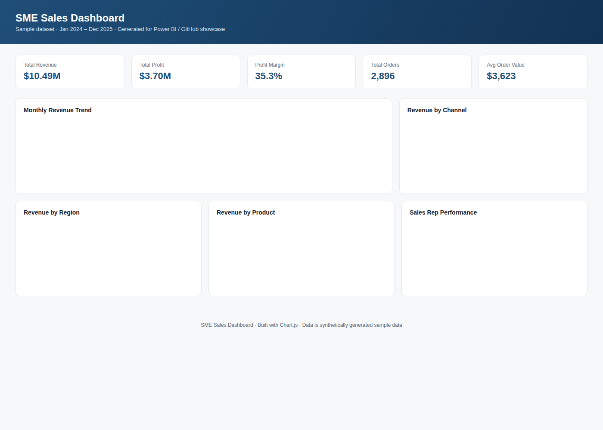
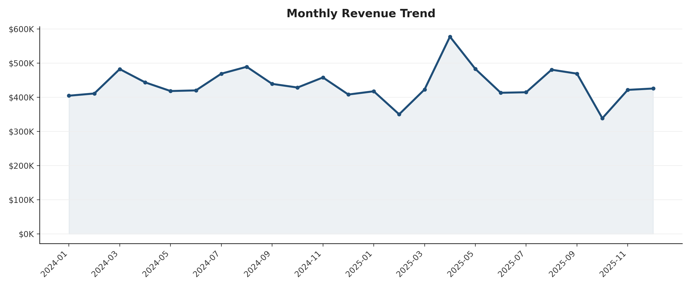
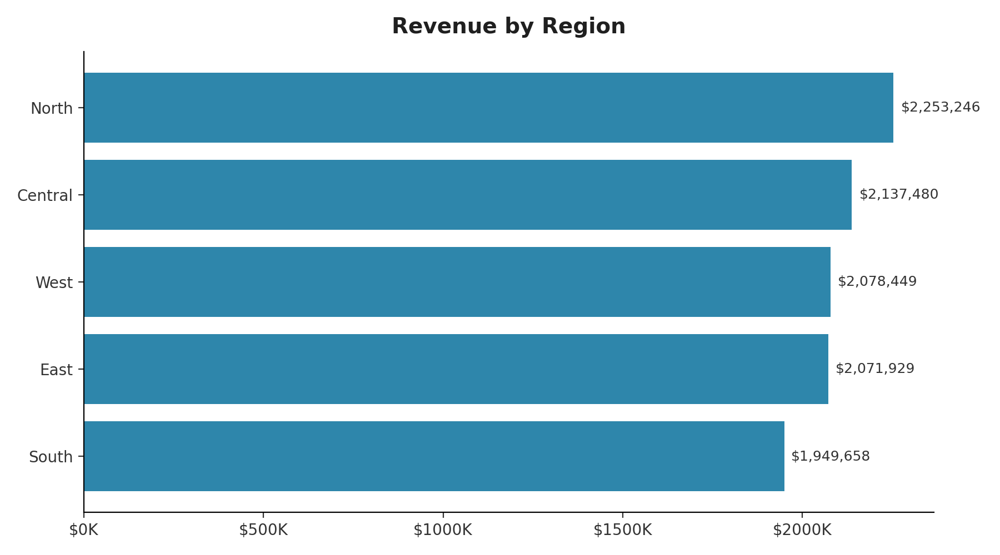
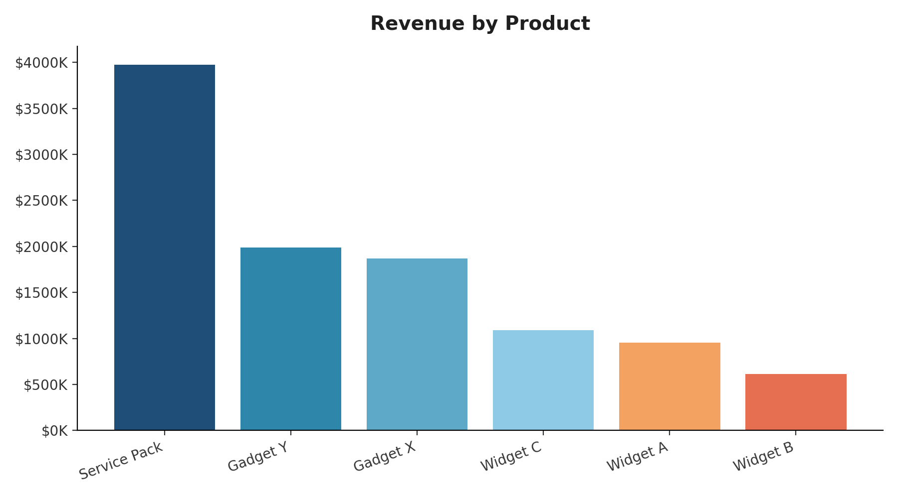
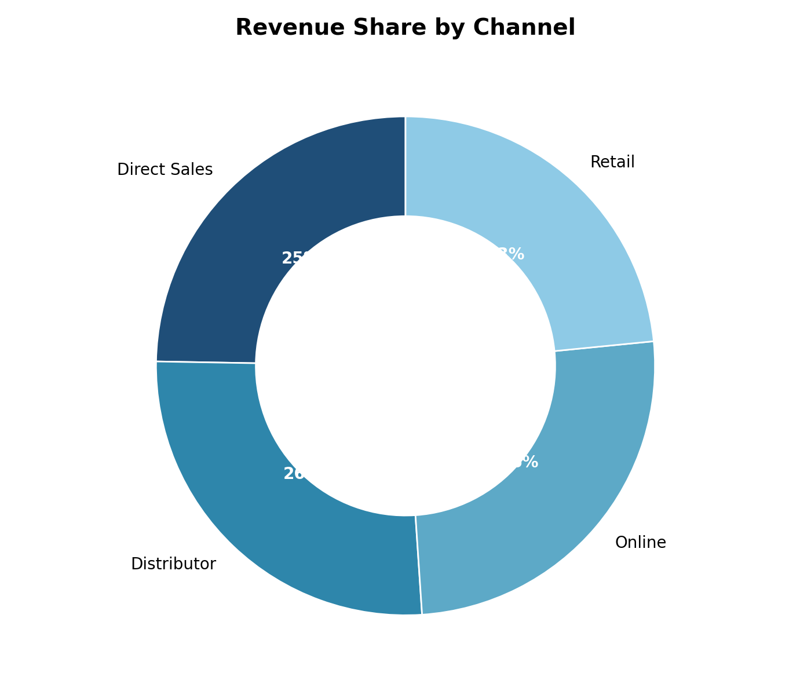
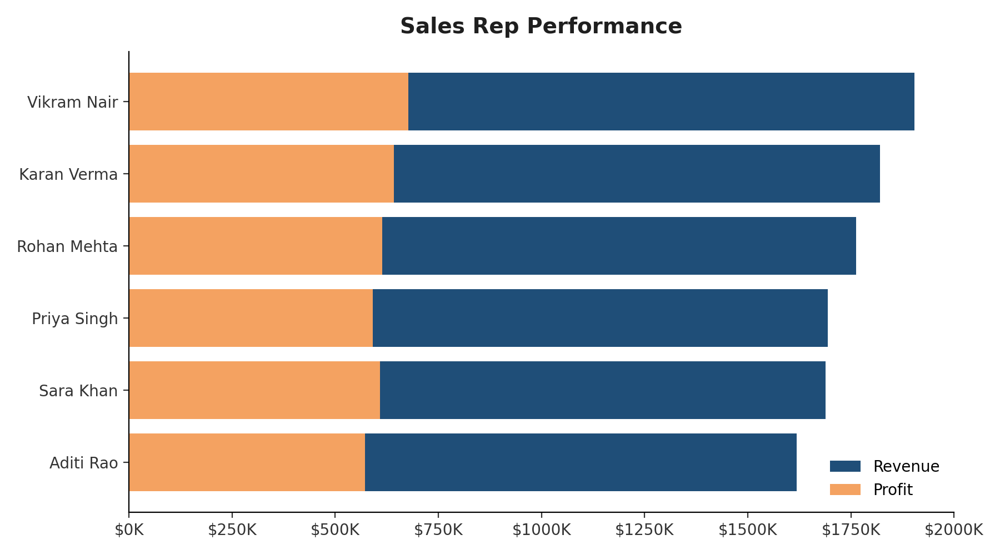

<div align="center">

# 📊 SME Sales Dashboard

**An interactive sales analytics dashboard built from synthetic SME data — ready for Power BI or the browser.**


</div>

---

## 🔍 Overview

A full sales analytics package for a fictional SME, covering **Jan 2024 – Dec 2025** across regions, products, channels, and sales reps.

| Metric | Value |
|---|---|
| Total Orders | 2,896 |
| Total Revenue | $10.49M |
| Total Profit | $3.70M |
| Profit Margin | 35.3% |

---

## 🖼️ Dashboard Preview

<div align="center">
  
</div>

<br>

<table>
  <tr>
    <td></td>
    <td></td>
  </tr>
  <tr>
    <td></td>
    <td></td>
  </tr>
  <tr>
    <td colspan="2" align="center"></td>
  </tr>
</table>

---

## 📁 Repository Structure
├── data/
│ └── SME_Sales_Data.xlsx # Source dataset (Excel Table, Power BI-ready)
├── dashboard/
│ └── index.html # Standalone interactive dashboard
├── images/ # Dashboard screenshots
└── README.md


---

## 🚀 Run It Locally

No build step, no dependencies. Just open the file:

```bash
git clone https://github.com/shaikayan13/powerbi-sme-sales-dashboard.git
cd powerbi-sme-sales-dashboard
open dashboard/index.html
```

Or enable **GitHub Pages** (`Settings → Pages → Deploy from /dashboard`) for a live hosted link.

---

## 🧮 Building in Power BI Desktop

1. **Get Data → Excel Workbook** → select `data/SME_Sales_Data.xlsx` → load the `SalesData` table.
2. Add a date table:
```DAX
   DateTable = CALENDAR(MIN(SalesData[Date]), MAX(SalesData[Date]))
```
3. Core measures:
```DAX
   Total Revenue   = SUM(SalesData[Revenue])
   Total Profit    = SUM(SalesData[Profit])
   Profit Margin % = DIVIDE([Total Profit], [Total Revenue])
   Total Orders    = DISTINCTCOUNT(SalesData[OrderID])
   Avg Order Value = DIVIDE([Total Revenue], [Total Orders])
```
4. Add KPI cards, a revenue trend line, region/product/channel breakdowns, and slicers for Date, Region, Category, and Channel.

Full guide is also in the **ReadMe** tab inside the Excel file.

---

## 🛠️ Tech Stack

- **Chart.js** — interactive charts in the HTML dashboard
- **Python (pandas, openpyxl)** — dataset generation and formatting
- **Power BI Desktop** — optional native dashboard build

---

## 📌 Note

Data is **synthetically generated** for demo/portfolio purposes and does not represent a real business.

<div align="center">

⭐ If this helped you, consider starring the repo!

</div>
